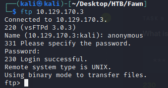
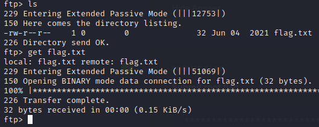
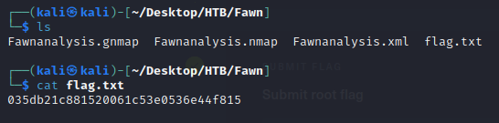

# Fawn (Linux)

## Solución

1. Con nmap se descubrio el puerto 21 abierto con el servicio ftp
2. Se comanda ftp con la respectiva ip para entrar al servicio. El usuario que se agrega es ‘anonymous’, ya que este no pide contraseña

1. Se verifica con ‘ls’ los archivos dentro de la maquina, y con get se descargan a la maquina del atacante

1. Se verifica si se descargo, y se lee el archivo
    
    
    
    ## Flag
    
    035db21c881520061c53e0536e44f815