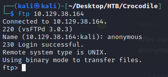
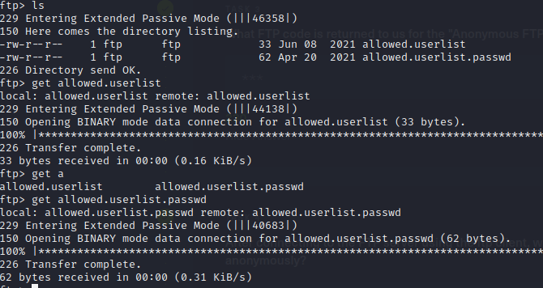
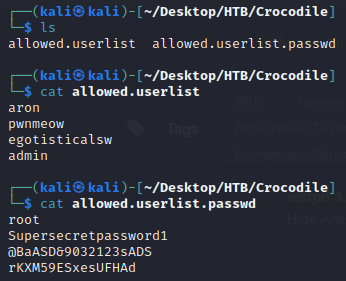
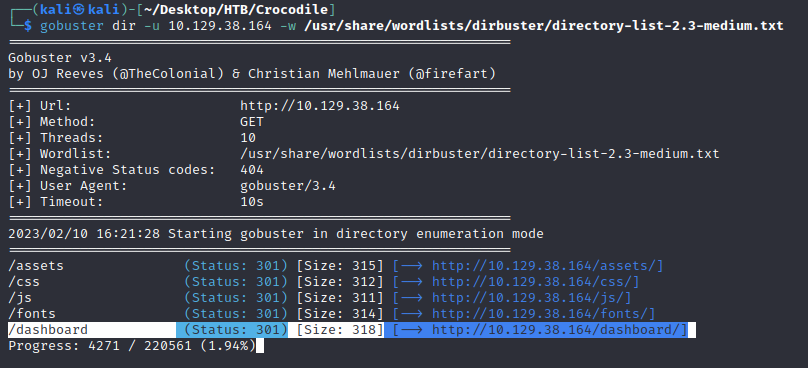
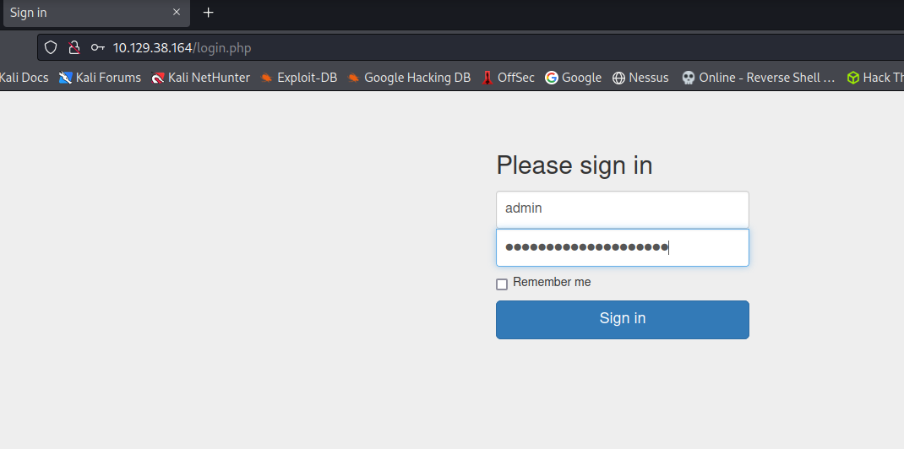

# Crocodile (Linux)

- Se encontro el puerto 21 abierto con el servicio ftp y el servicio 80 abierto con el servicio http
- Se ingresa al servicio ftp por medio de la consola
    
    
    
- Comandar ls para ver los documentos y extraer los de interes.
    
    
    
- Verificamos el contenido de los archivos

- Entramos al sitio http de la ip de la maquina atacante.
    
    
    
- Para poder encontrar una pista de la flag, se intenta encontrar alguna vulnereabilidad del sitio, no se encontro una a la vista, por lo que con gobuster intentare encontrar una url
- Con el siguiente comando de gobuster encontre una url que me llamo la antencion, por lo que entre en ella
    
    
    
- En esta interface puedo probar los usuarios y contraseñas que encontre previamente

- Con el usuario:’admin’ y la contraseña ‘rKXM59ESxesUFHAd’ pude ingresar y encontrar la bandera

# Flag

c7110277ac44d78b6a9fff2232434d16