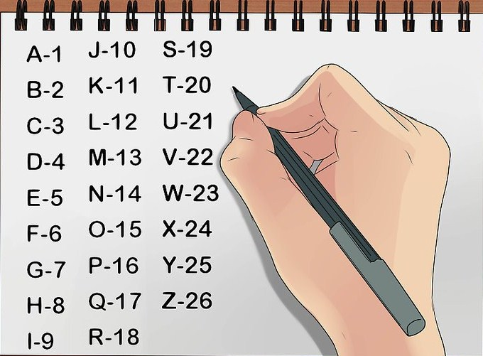

## Descripción
The [numbers](https://jupiter.challenges.picoctf.org/static/f209a32253affb6f547a585649ba4fda/the_numbers.png)... what do they mean?

## Pistas
- The flag is in the format PICOCTF{}
## Solución
- Para resolver este reto, se nos da una imagen con la flag representada por numeros.
- Estos numeros no son deciamles que se puedan transformar en ASCII, si no que son las posiciones de la letra en el abecedario en ingles.
- Por lo que solo tenemos que sustituir la el numero por la letra que le corresponde en el abecedario, yo me guie con esta imagen:



- por lo que la flag seria:
```bash()
picoCTF{thenumbersmason}
```

## Notas adicionales
- Los numeros no son octal u decimales para transformar a ASCII, si no que son literalmente la posicion de la letra en el abecedario.

## Referencias 